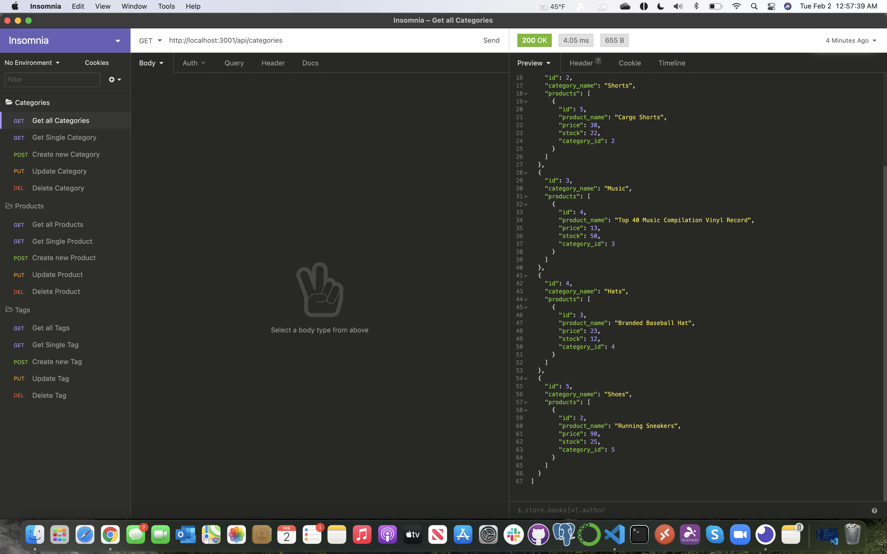
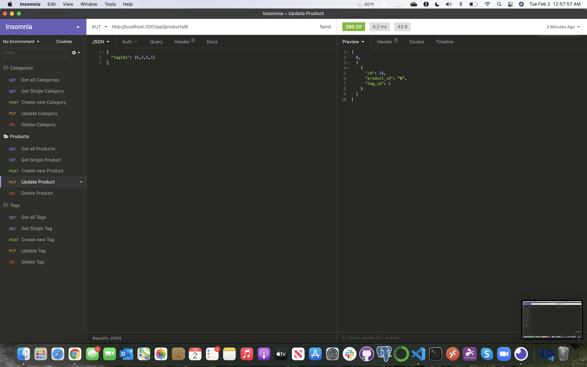
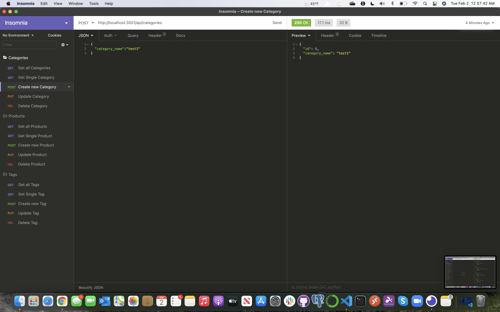
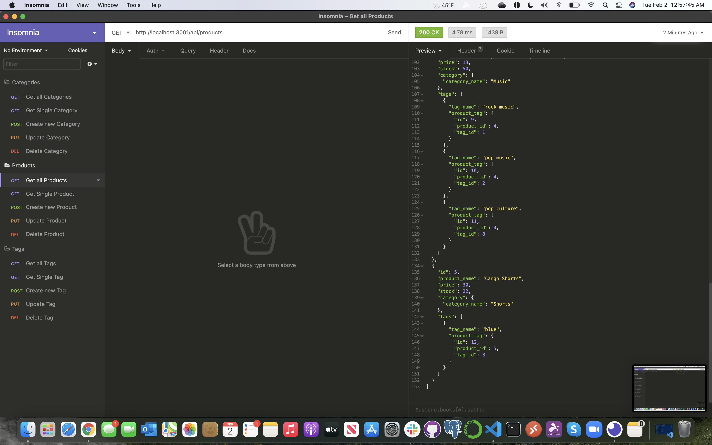
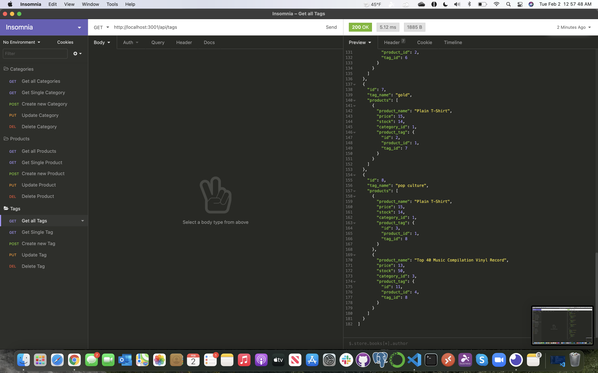
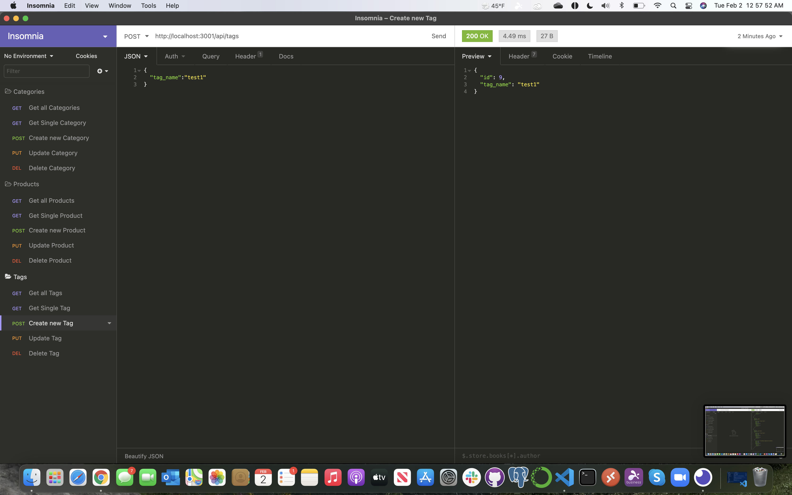

# 13-Object-Relational-Mapping-Challenge
Employee Tracker

## Table of Contents

* [Description](#Description)
* [Requirements](#Requirements)
* [Installation](#Installation)
* [Usage](#Usage)
* [License](#License)
* [Badges](#Badges)
* [Issues](#Issues)
* [Technologies](#Technologies)
* [Screenshot](#screenshot)
* [Walkthrough-Video](#walkthrough-video)
* [Deployment](#deployment)
* [Contributing](#Contributing)
</br>
</br>

## Description
Example of ORM to build the back end for an e-commerce site with a working Express.js API and configure it to use Sequelize to interact with a MySQL database.
<br>
<br>

## Requirements
#### User Story
>AS A manager at an internet retail company, I WANT a back end for my e-commerce website that uses the latest technologies. SO THAT my company can compete with other e-commerce companie.
<br>

>GIVEN a functional Express.js API
<br>

>WHEN I add my database name, MySQL username, and MySQL password to an environment variable file<br>
>>THEN I am able to connect to a database using Sequelize<br>

>WHEN I enter schema and seed commands<br>
>>THEN a development database is created and is seeded with test data<br>

>WHEN I enter the command to invoke the application<br>
>>THEN my server is started and the Sequelize models are synced to the MySQL database<br>

>WHEN I open API GET routes in Insomnia Core for categories, products, or tags<br>
>>THEN the data for each of these routes is displayed in a formatted JSON<br>

>WHEN I test API POST, PUT, and DELETE routes in Insomnia Core<br>
>>THEN I am able to successfully create, update, and delete data in my database<br>

<br>
<br>

## Installation
To use this application, please install: 
```
npm install
npm install mysql2
npm install sequelize
npm install dotenv
```

<br/>
<br/>

## Usage
After cloning the repo and installing the required npm packages, use the command line to navigate to the root of the application and 
```
run npm run seed
npm start
```

<br/>
<br/>

## License 
[](https://opensource.org/licenses/MIT)
</br>
</br>

## Badges


</br>
</br>

## Issues
[](https://GitHub.com/jorgeebn16/13-Object-Relational-Mapping-Challenge/issues/)
[](https://GitHub.com/jorgeebn16/13-Object-Relational-Mapping-Challenge/issues?q=is%3Aissue+is%3Aclosed)
</br>
</br>

## Technologies
* [Javascript](https://developer.mozilla.org/en-US/docs/Web/JavaScript)
* [jQuery](https://jquery.com/)
* [npm](https://www.npmjs.com/)
* [mysql2](https://www.npmjs.com/package/mysql2)
* [sequelize](https://sequelize.org/)
* [dotenv](https://www.npmjs.com/package/dotenv)
<br/>
<br/>

## Screenshot






</br>
</br>

## Walkthrough Video
View the [Setup Walkthrough video here.](https://drive.google.com/file/d/1sUU-tM-kytoyfZ41aLFmqWH-9-BDkngr/view)</br>
View the [API routes Walkthrough video here.](https://drive.google.com/file/d/177WDjX3A5898q-4HjNFiWlaUR9TVVQi7/view)
</br>
</br>

## Deployment
View [Github repository URL](https://github.com/jorgeebn16/13-Object-Relational-Mapping-Challenge)

## Contributing
[](https://GitHub.com/Naereen/jorgeebn16/13-Object-Relational-Mapping-Challenge/graphs/contributors/)

For anyone who wishes to contribute you can contact me with at jorgeebn16@gmail.com
</br>
</br>

Would you like to reach me?
</br>
Contact Me:

Github: https://github.com/jorgeebn16</br>
Email: jorgeebn16@gmail.com


## Issues
[](https://GitHub.com/jorgeebn16/13-Object-Relational-Mapping-Challenge/issues/)
[](https://GitHub.com/jorgeebn16/13-Object-Relational-Mapping-Challenge/issues?q=is%3Aissue+is%3Aclosed)


